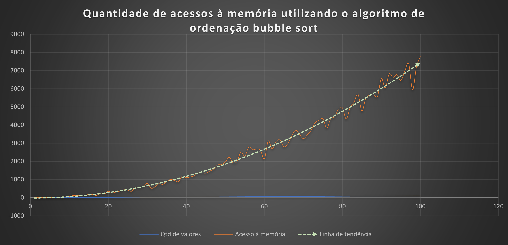

## TRABALHO I DE BUSCA E ORDENAÇÃO 
#### Por: Breno Vambáster

## To-do list
- [x] Mostrar o estado da lista a cada iteração do algoritmo, i.e. ao nal de cada iteração do while da linha 5 do Algoritmo 3 do estudo dirigido 3.
- [x] Mostrar o número de acessos à estrutura de dados (você pode considerar tanto escrita como leitura como acesso) ao nal da execução do Bubble Sort.
- [x] Teste 4.1
- [x] Teste 4.2 

## Gráfico de acesso à memória  em função da quantidade de valores na lista de ordenação utilizando o algoritmo bubble sort

