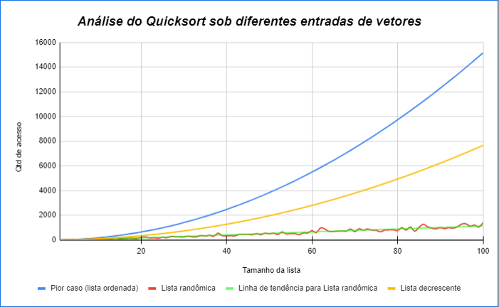

# 0 Explicação em vídeo :

# 1 Análise do algoritmo de ordenação quicksort sob diferentes tipos de entrada 

 ## 1.1 ***lista ordenada com valores crescentes (pior caso)***

  Quantidade de acesso para ordenar ***lista ordenada com valores crescentes*** (pior caso) com o `1>= tamanho da lista <=100`
 
  Cada posicão do array adiante, equivale a quantidade de acesso para ordenar a lista do respectivo tamanho. Ex: `v[0]` = Qtd de acesso para ordenar uma lista de tamanho 1; `v[1]` para ordenar lista de tamanho 2... etc.

    0	6	15	27	42	60	81	105	132	162	195	231	270	312	357	405	456	510	567	627	690	756	825	897	972	1050	1131	1215	1302	1392	1485	1581	1680	1782	1887	1995	2106	2220	2337	2457	2580	2706	2835	2967	3102	3240	3381	3525	3672	3822	3975	4131	4290	4452	4617	4785	4956	5130	5307	5487	5670	5856	6045	6237	6432	6630	6831	7035	7242	7452	7665	7881	8100	8322	8547	8775	9006	9240	9477	9717	9960	10206	10455	10707	10962	11220	11481	11745	12012	12282	12555	12831	13110	13392	13677	13965	14256	14550	14847	15147 

 ## 1.2 lista ordenada de forma decrescente

  Para ***lista ordenada de forma decrescente***, com o tamanho da lista variando de 1<= tam <=100

    0	3	9	15	24	33	45	57	72	87	105	123	144	165	189	213	240	267	297	327	360	393	429	465	504	543	585	627	672	717	765	813	864	915	969	1023	1080	1137	1197	1257	1320	1383	1449	1515	1584	1653	1725	1797	1872	1947	2025	2103	2184	2265	2349	2433	2520	2607	2697	2787	2880	2973	3069	3165	3264	3363	3465	3567	3672	3777	3885	3993	4104	4215	4329	4443	4560	4677	4797	4917	5040	5163	5289	5415	5544	5673	5805	5937	6072	6207	6345	6483	6624	6765	6909	7053	7200	7347	7497	7647

 ## 1.3 lista gerada de forma randômica
  ara ***lista gerada de forma randômica*** (caso médio ou, dependendo da situação, pode ser melhor caso) com o tamanho da lista variando de 1<= tam <=100

    0	3	12	9	33	15	45	54	48	78	48	45	69	165	93	111	123	120	108	186	234	150	165	129	204	171	276	249	240	228	288	237	240	348	303	363	285	540	330	321	330	324	435	447	441	411	498	408	537	483	534	435	636	471	504	504	411	564	552	738	576	966	873	672	672	696	705	696	864	660	891	780	873	774	762	648	783	801	807	741	978	783	1041	693	999	1260	1059	933	888	987	900	978	942	1050	1269	1290	1098	1194	1032	1380	

# 2. Gráfico: Comparação do número de acessos
