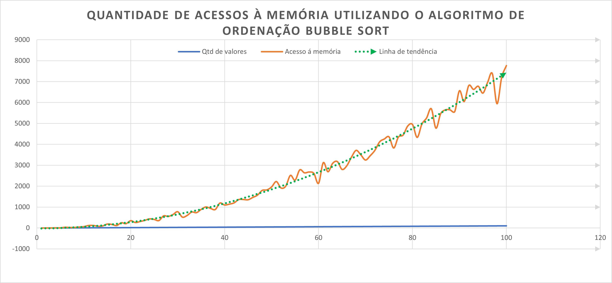
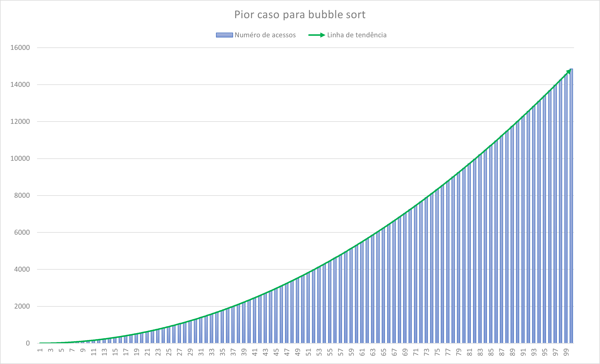

## TRABALHO I DE BUSCA E ORDENAÇÃO 
Por: Breno Vambáster Cardoso Lima


- [1) O QUE É BUBBLE SORT?](#1-o-que-é-bubble-sort)
- [2) Da motivação para a escolha do tipo de lista utilizada](#2-da-motivação-para-a-escolha-do-tipo-de-lista-utilizada)
- [3. Aacesso à memória  em função da quantidade de valores na lista de ordenação utilizando o algoritmo bubble sort.](#3-aacesso-à-memória--em-função-da-quantidade-de-valores-na-lista-de-ordenação-utilizando-o-algoritmo-bubble-sort)
- [4. Análise dos dados para o pior caso](#4-análise-dos-dados-para-o-pior-caso)


# 1) O QUE É BUBBLE SORT? 
-  Algoritmo de ordenação O(n²)
- Funcionamento
  - 


# 2) Da motivação para a escolha do tipo de lista utilizada
    Abrir OneNote;


# 3. Aacesso à memória  em função da quantidade de valores na lista de ordenação utilizando o algoritmo bubble sort.

Com a lista de valores gerada  randômicamente



# 4. Análise dos dados para o pior caso 

Seja a seguinte função para criarmos os vetores de pior caso;
    
```c++

int pior_caso(int *array, int tamanho_max)
{

    /*  para cada vetor gerado, armazenar o número de acesso e a quantidade de valores no array */
    int array_num_acessos[TAM_MAX], array_qtd_valores[TAM_MAX];

    for (int i = 1; i <= tamanho_max; i++)
    {
        // gerar vetor decrescente;
        for (int j = 0; j < i; j++)
        {
            array[j] = tamanho_max - j;
        }
        cout << "array:" << i << endl;
        cout << "  array gerado:";
        imprime(array, i);
        array_num_acessos[i - 1] = bubble_sort(array, i, 0);
        array_qtd_valores[i - 1] = i;
        cout << "\n  array organizado:";
        imprime(array, i);
        cout << "\n\n";
    }

    imprime(array_num_acessos, tamanho_max);
    imprime(array_qtd_valores, tamanho_max);
}

```

Obtivemos o seguinte resultado para a quantidade de acessos no pior caso (lista em ordem decrescente):



