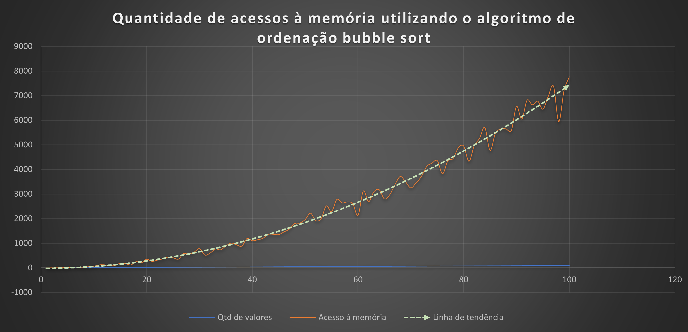
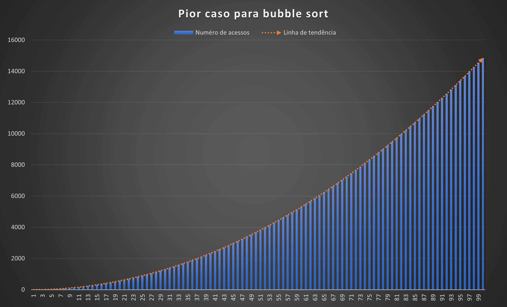

## TRABALHO I DE BUSCA E ORDENAÇÃO 
#### Por: Breno Vambáster

## 1. To-do list
- [x] Mostrar o estado da lista a cada iteração do algoritmo, i.e. ao nal de cada iteração do while da linha 5 do Algoritmo 3 do estudo dirigido 3.
- [x] Mostrar o número de acessos à estrutura de dados (você pode considerar tanto escrita como leitura como acesso) ao nal da execução do Bubble Sort.
- [x] Teste 4.1
- [x] Teste 4.2 


## 2. Gráfico de acesso à memória  em função da quantidade de valores na lista de ordenação utilizando o algoritmo bubble sort



## 3. Análise dos dados para o pior caso 

Seja a seguinte função para criarmos os vetores de pior caso;
    
```c++

int pior_caso(int *array, int tamanho_max)
{

    /*  para cada vetor gerado, armazenar o número de acesso e a quantidade de valores no array */
    int array_num_acessos[TAM_MAX], array_qtd_valores[TAM_MAX];

    for (int i = 1; i <= tamanho_max; i++)
    {
        // gerar vetor aleatorio;
        for (int j = 0; j < i; j++)
        {
            array[j] = tamanho_max - j;
        }
        cout << "array:" << i << endl;
        cout << "  array gerado:";
        imprime(array, i);
        array_num_acessos[i - 1] = bubble_sort(array, i, 0);
        array_qtd_valores[i - 1] = i;
        cout << "\n  array organizado:";
        imprime(array, i);
        cout << "\n\n";
    }

    imprime(array_num_acessos, tamanho_max);
    imprime(array_qtd_valores, tamanho_max);
}

```

Obtivemos o seguinte resultado para a quantidade de acessos no pior caso(lista decrescente):



